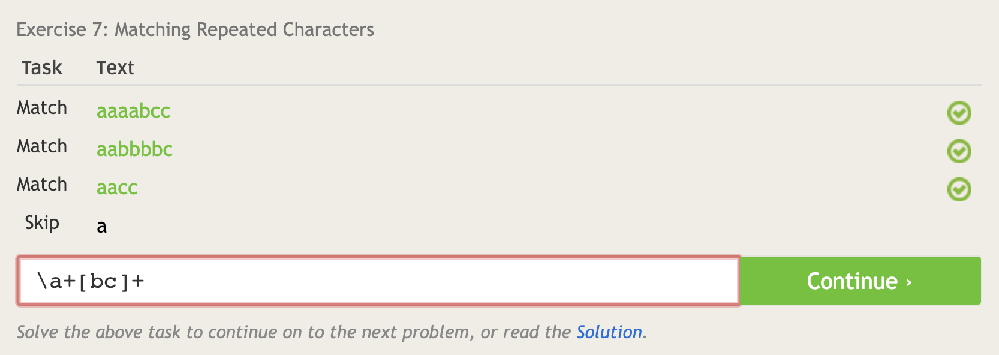

# Lab 1 Reflection
## 10 Parts of Open Source Definition

- The program must be free to distribute, and open to inspection/modification
- No discrimination
- License must be open and non-specific to allow for other software to arise 

## How to Answer Questions Helpfully
1. Don't try to appear that you are better because you know the answer, this may just upset the other person and make them less likely to want your help in the future.
2. If you can't help someone directly, try to pool your resources to find someone who may be able to.

## Free Culture

From Chapter 3 of Free Culture, I learned a great deal about the perils of open source work and the importance of being careful when creating software. Without proper licensing, it can be very difficult to properly protect yourself, your project, and your family. Many companies have the power and the resources to go after small projects that don't threaten them, so you need to be careful even with smaller project sizes. On the other hand, it also showed me that passion projects are things that can expand into something meaningful and visible, so trying hard on something you enjoy can be a great use of time. The search engine, while not fully Jessie's work, was the expansion of work from those who came before, and left in a state that it was possible to expand and improve. Jessie improved a system that was worked on by many others before him because he was passionate about it, which is the spirit of open source. This story showed me that even if a project seems dead, or shoved in a corner somewhere and no longer maintained, the community around that software can revive if there is a competent and passionate leader of it. Overall, I think this story was a solid explanation of both the dangers of open source, as well as the reasons why it is such an amazing development for humanity.

---

### ```tree -d ```


---

## Regex Puzzles




## Player Puzzles Problems


## Blockly Puzzle Solved


# Reflection
## Interesting Open Source Project: ```eliotstocker/Light-Controller```

I am very interested in home lighting and automation, and this project has a beautiful user interface as well as promises to be compatible with a variety of lighting solutions. My long-term goal for my career is to do something with IoT and smart lighting control, so this project immediately jumped out at me when I found it. It appears to have been abandoned for about two years, but I am sure there are more tweaks and updates that could be done with it.