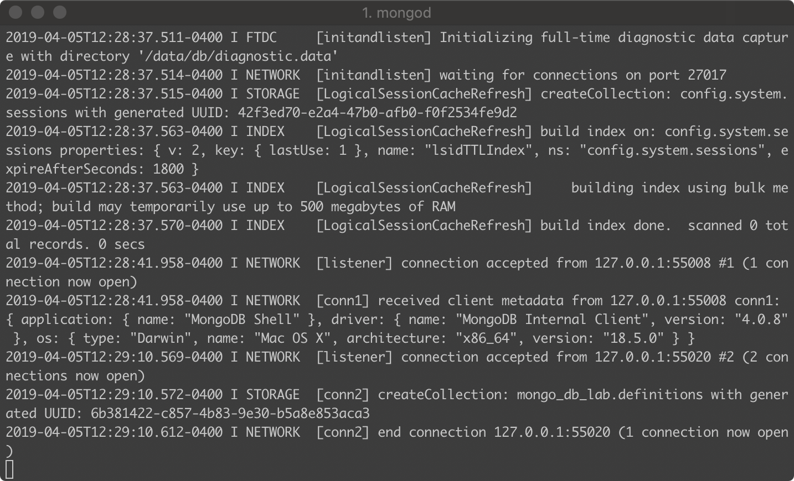
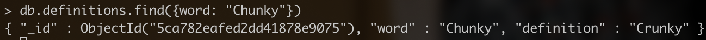
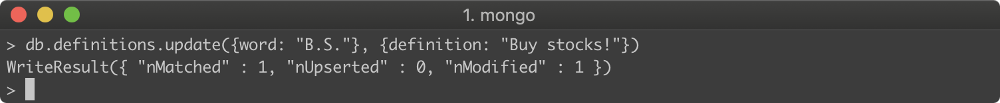
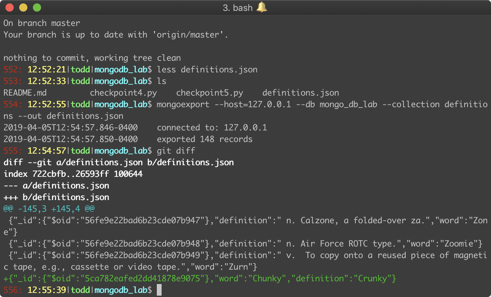
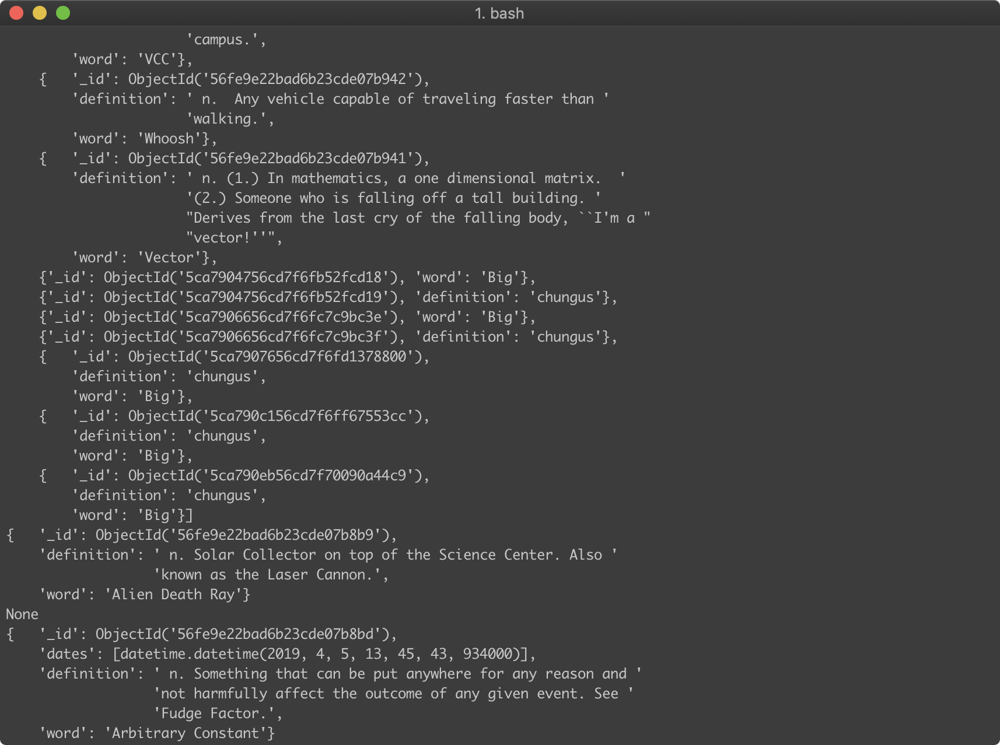
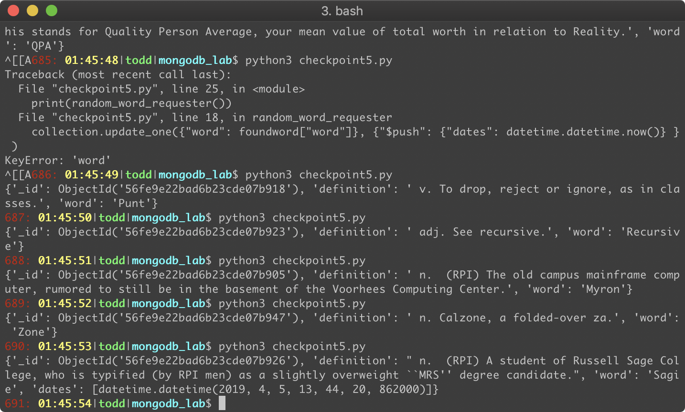

# OSS Lab 10

## Todd Louison

### Checkpoint 1/Checkpoint 2

Here is the connection successful message from `mongod`, as well as the collection created message for checkpoint 2:



### Checkpoint 3

Here is are the record I added, the record I changed, and the `git diff` result:

##### Entered



##### Updated



##### `git diff`



### Checkpoint 4

#### Script

```python
from pymongo import MongoClient
from bson.objectid import ObjectId
import pprint

client = MongoClient()

if __name__ == '__main__':
	pp = pprint.PrettyPrinter(indent=4)

	db = client["mongo_db_lab"]
	collection = db["definitions"]

	allRecords = list(collection.find())
	pp.pprint( allRecords )

	oneRecords = collection.find_one()
	pp.pprint( oneRecords )

	specificRecord = collection.find_one({"word": "B.S."})
	pp.pprint( specificRecord )

	objectById = collection.find_one({"_id": ObjectId("56fe9e22bad6b23cde07b8bd")})
	pp.pprint( objectById )

	insertingObject = {"word": "Big",
						"definition": "chungus"}
	collection.insert_one(insertingObject)
	insertedWord  = collection.find_one({"word": "Big"})
	pp.pprint( insertedWord )
```

#### Output



### Checkpoint 5

#### Script

```python
from pymongo import MongoClient
import pprint
import datetime
import random
client = MongoClient()

def random_word_requester():
	'''
	This function should return a random word and its definition and also
	log in the MongoDB database the timestamp that it was accessed.
	'''
	db = client["mongo_db_lab"]
	collection = db["definitions"]
	index = random.randint(0, collection.count() )
	foundword = list(collection.find())[index]

	collection.update_one({"word": foundword["word"]}, {"$push": {"dates": datetime.datetime.now()} } )

	return foundword

if __name__ == '__main__':
	print(random_word_requester())
```

#### Output



When searched for in the `mongo` session, we find:

