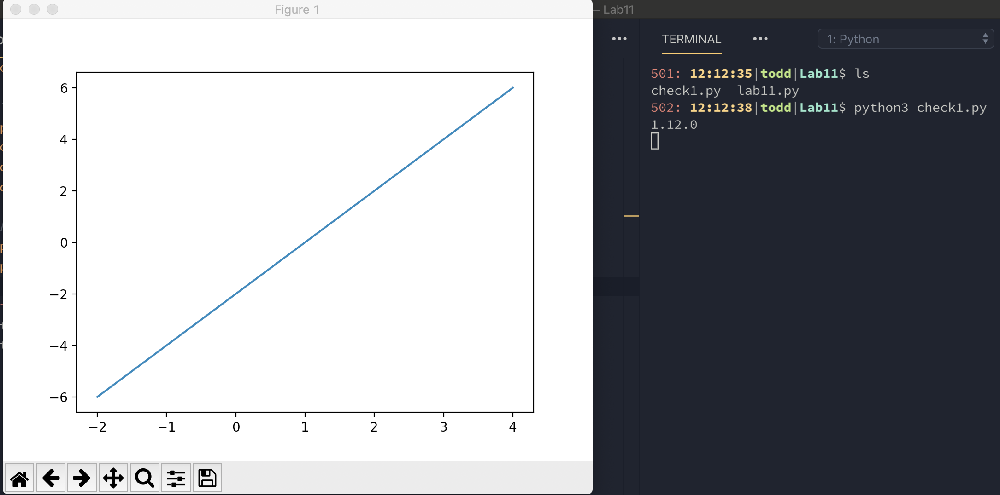
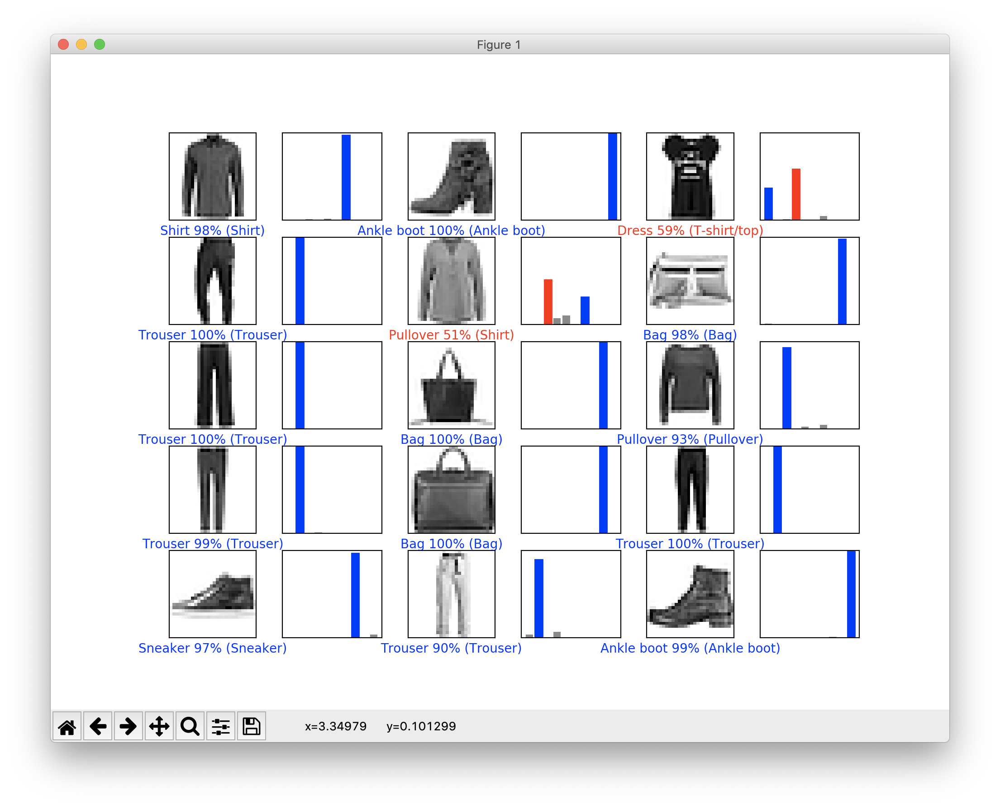
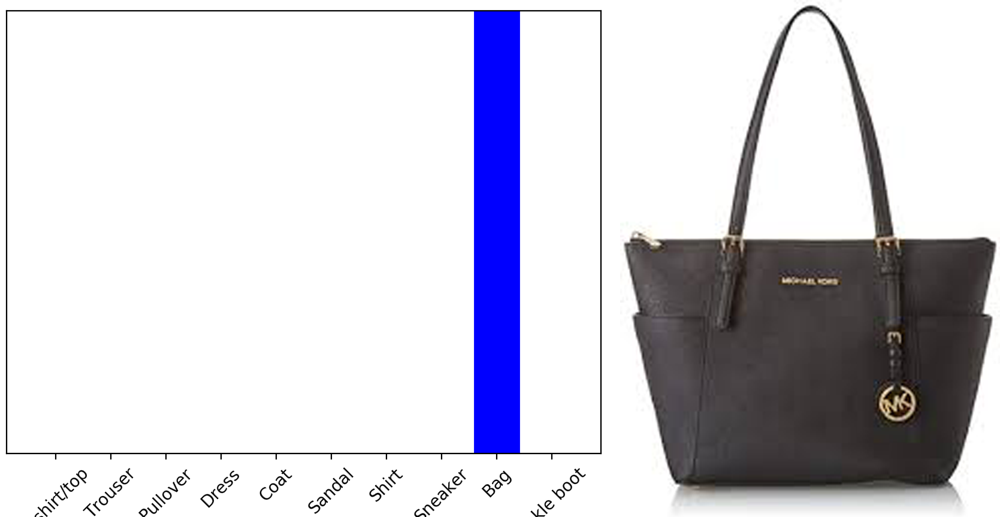
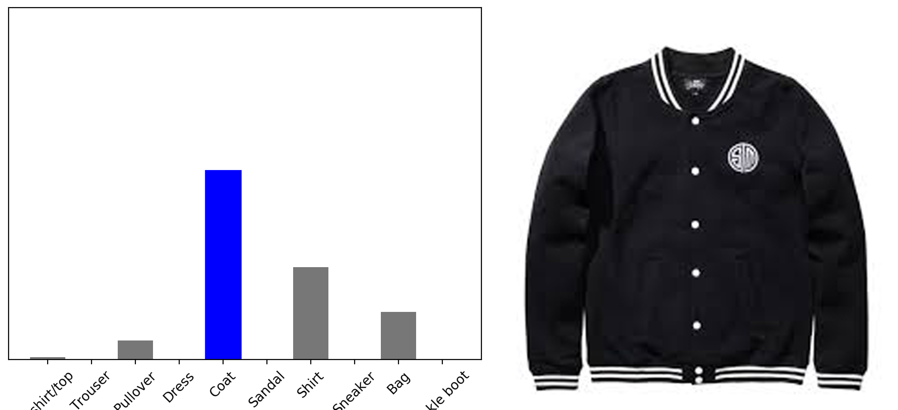
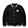
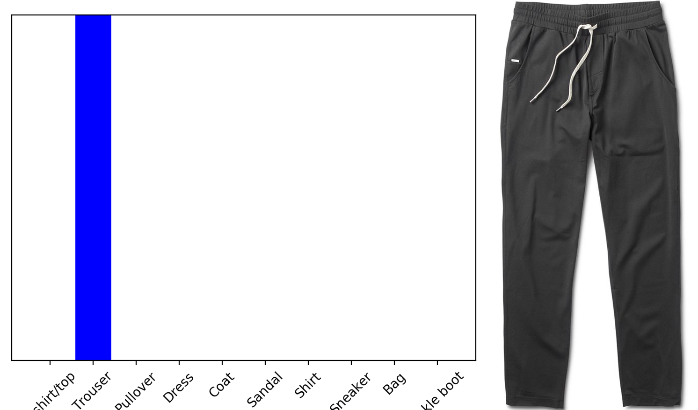
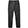

# Lab 11: TensorFlow

## Todd Louison

### Checkpoint 1

Here is the figure showing the correct install of TensorFlow

### Checkpoint 2

Here is the plot of the TensorFlow Classification

### Checkpoint 3

Here are the three attempts at classifiying articles of clothing:

---

---

