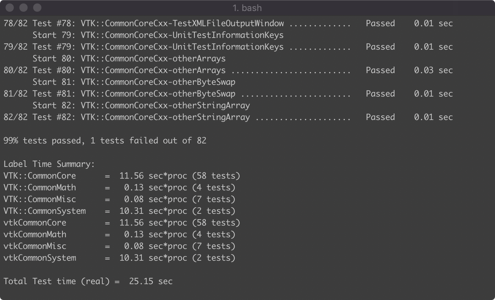
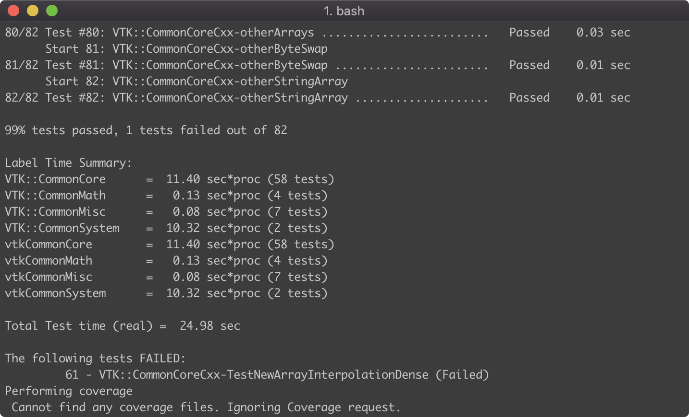
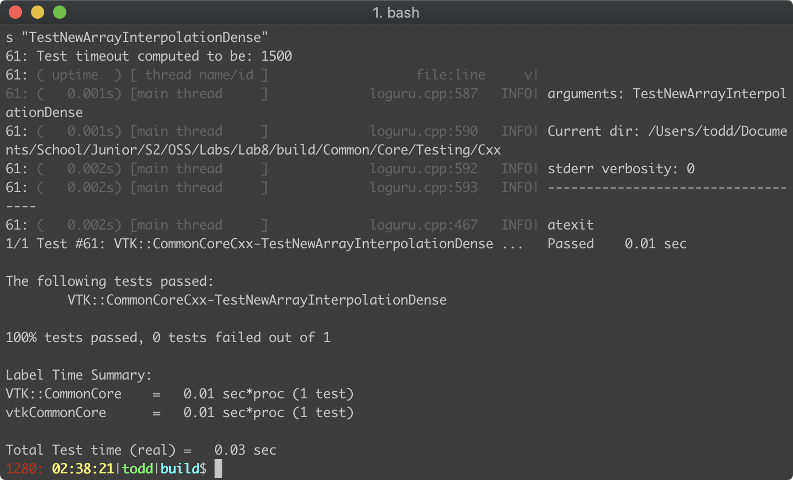
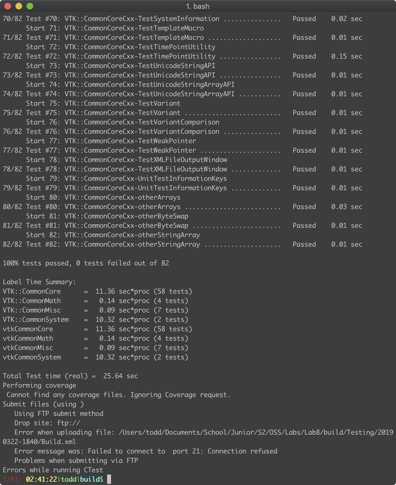

# Lab 8

## Todd Louison

## Checkpoint 2

#### While the system is building...

**1)** **Find the Nightly and Experimental sections and look at some of the submissions. How can you see what tests were run for a particular submission?**

​	If you click on the numbers underneath the "Test" section (i.e. Fail, Pass) it will tell you which tests were run that resulted in each of those answers. Not Run simply tells you which tests were not run, so you can cross reference it that way if you want.

**2) Find a submission with errors. Can you see what the error condition was? How does this help you debug the failure?**

​	The submission is BillsUbuntu, Ubuntu14-gcc-4.8.4-Release-WikiExamples. You can see each error condition of the 45 individually, and the traceback of that. This is obviously very helpful, because it is the information that we would be given if an error occurred locally.

**3) Find a system that is close to your specific configuration in the Nightly section. How clean is the dashboard? Are there any errors that you need to be concerned with?**

​	The similar system is building with AppleClang9.1 on MacOS 10.13.6. The dashboard is somewhat clean, with no errors, but 50 warnings taking up a good amount of space on the page. There are no errors to be concerned with.

**3) Go back to the dashboard and find your submission. Are there any errors? If so, are they consistent with other projects using your architecture? If not, fix any sugnificant errors in your system and resubmit to the dashboard until your system performs similarly to equivalent architectures.**	

​	There was 1 error, which is consistent with other projects using my architecture.

## Checkpoint 3

Cannot send to dashboard. Output is as follows from terminal:

## Checkpoint 4

Successfully fixed the test case

Here is a screenshot of the entire suite running:

