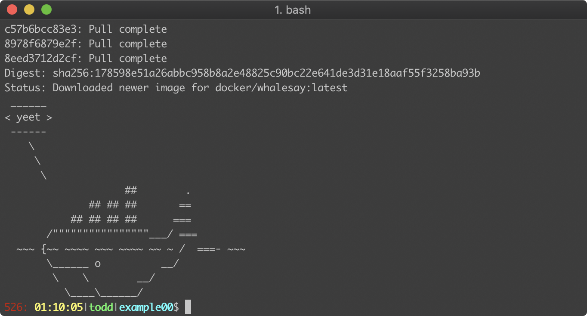
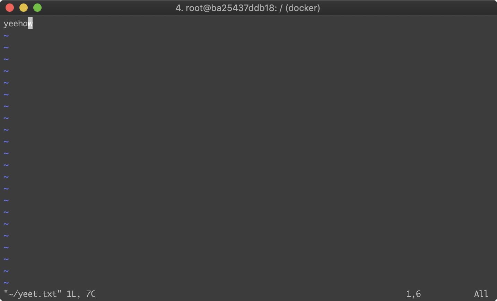
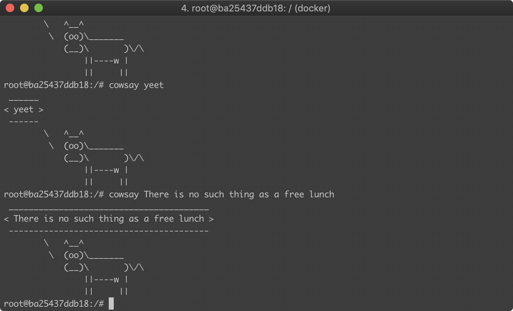
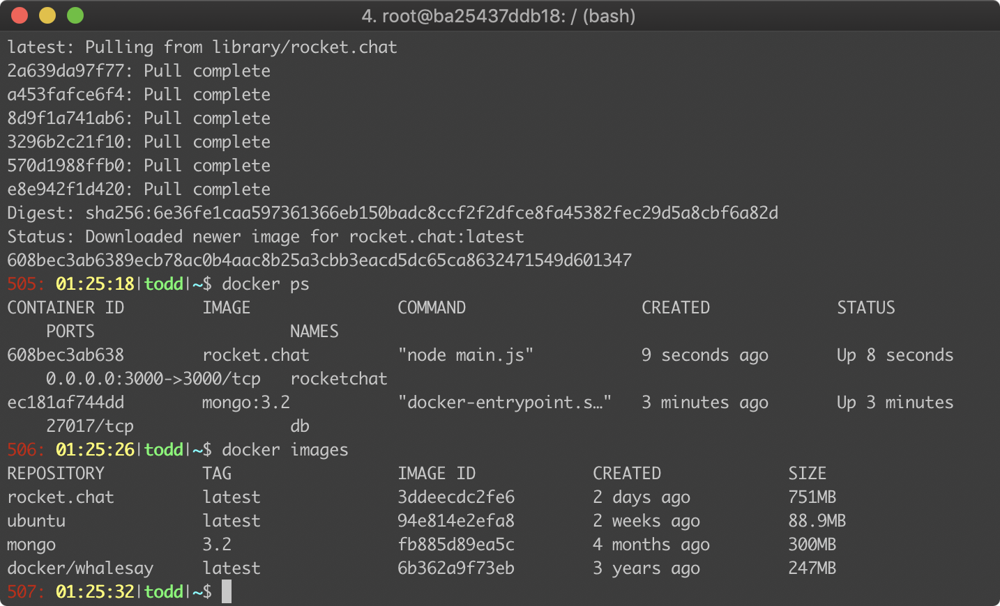
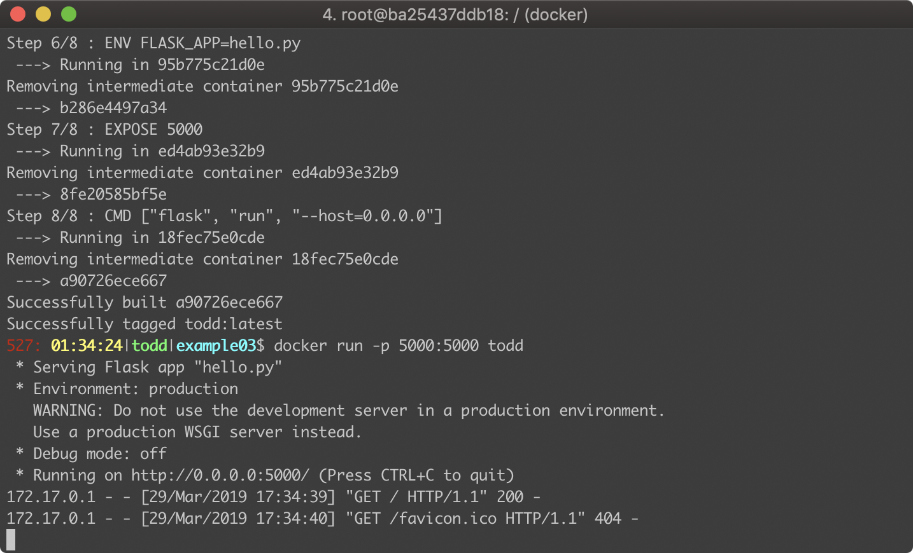
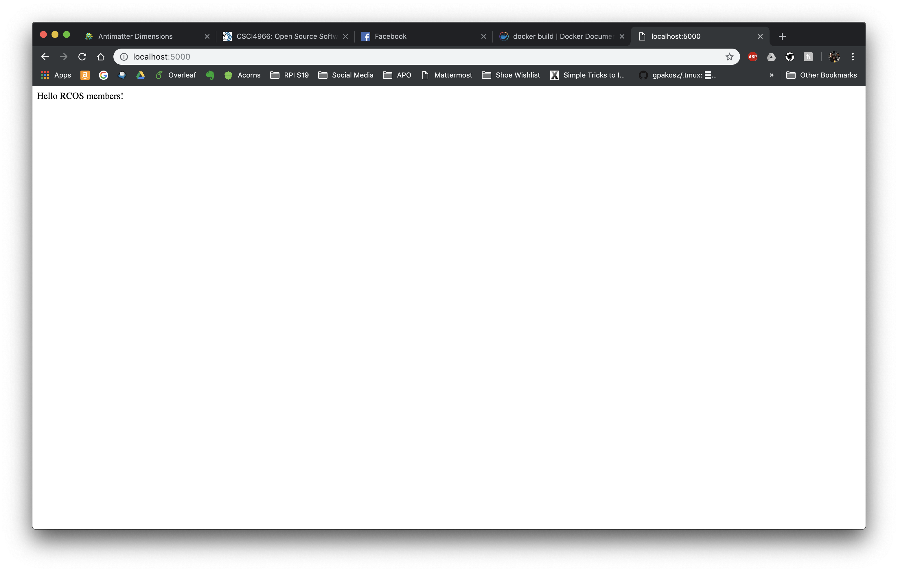
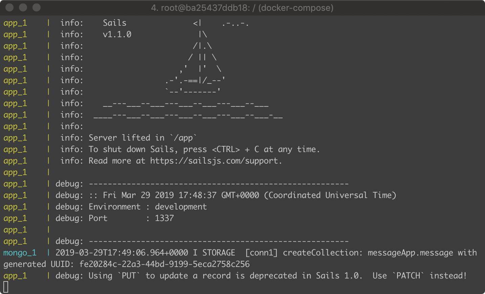
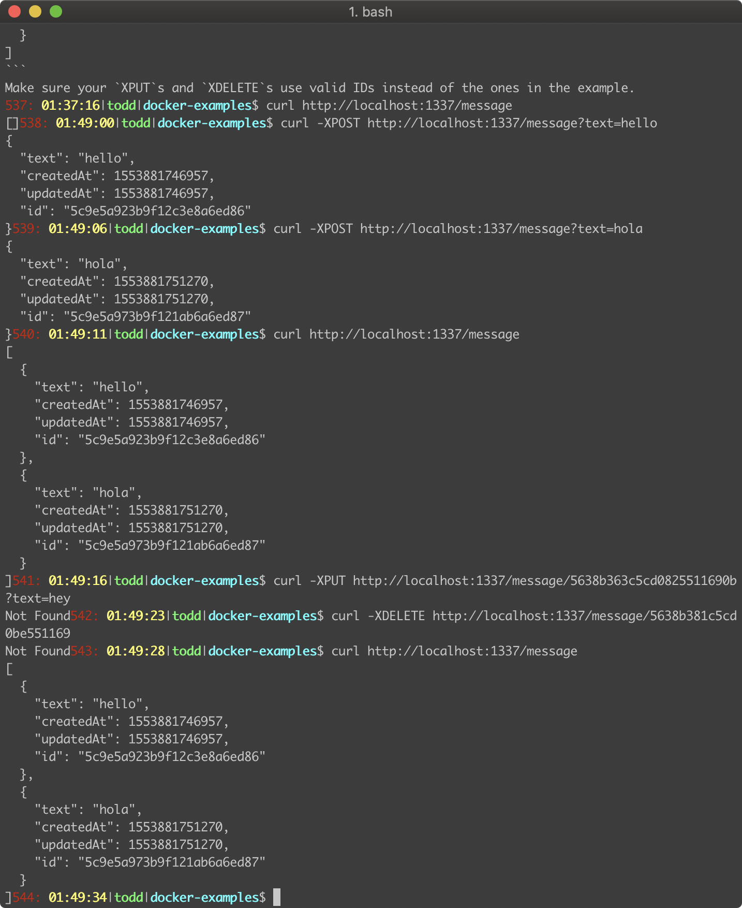

# OSS Lab 9: Virtualization and Docker

## Todd Louison

### Example 0

I attempted to download the Docker.dmg from Docker's website, but due to impossibly slow internet speeds, a kind classmate AirDropped the application to me.

### Example 1

The Ubunutu container worked correctly. I added a file to the root directory, and the contents are as follows:

Here is an image of cowsay working:

### Example 02

Here is a screenshot of rocketchat running:

### Example 03

Here is a screenshot of the docker container running:

And here is what the website displays on `localhost:5000`:

### Example 04

Here is a screenshot of the message app running:

Here are some of the curl commands we were asked to run:

